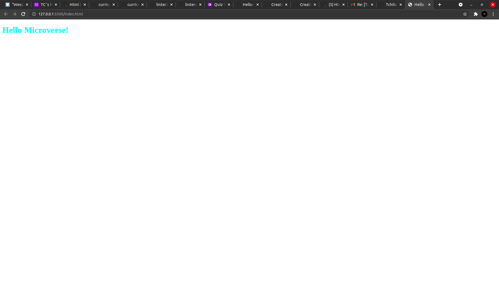

# Hello Microverse

> Learning how to add linter files 



Additional description about the project and its features.

## Built With


- CSS
- HTML


## Getting Started

**To get a copy of this repo into your local machine run the following command:**
```
git clone git@github.com:Tchilo/Hello-Microverse.git 
cd Hello-Microverse
in visual studio code you can click the go live button to view it live in the browser.
```


## Authors

👤 **Taro**

- GitHub: [@githubhandle](https://github.com/Tchilo)


## 🤝 Contributing

Contributions, issues, and feature requests are welcome!

Feel free to check the [issues page](../../issues/).

## Show your support

Give a ⭐️ if you like this project!

## Acknowledgments

- Hat tip to anyone whose code was used
- Inspiration
- etc

## 📝 License

This project is [MIT](./MIT.md) licensed.
